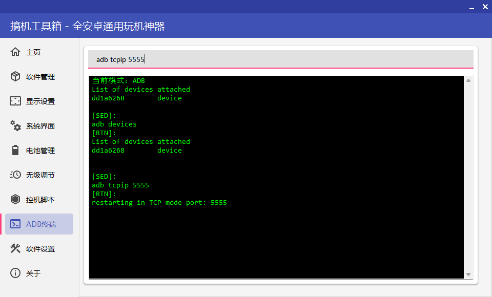
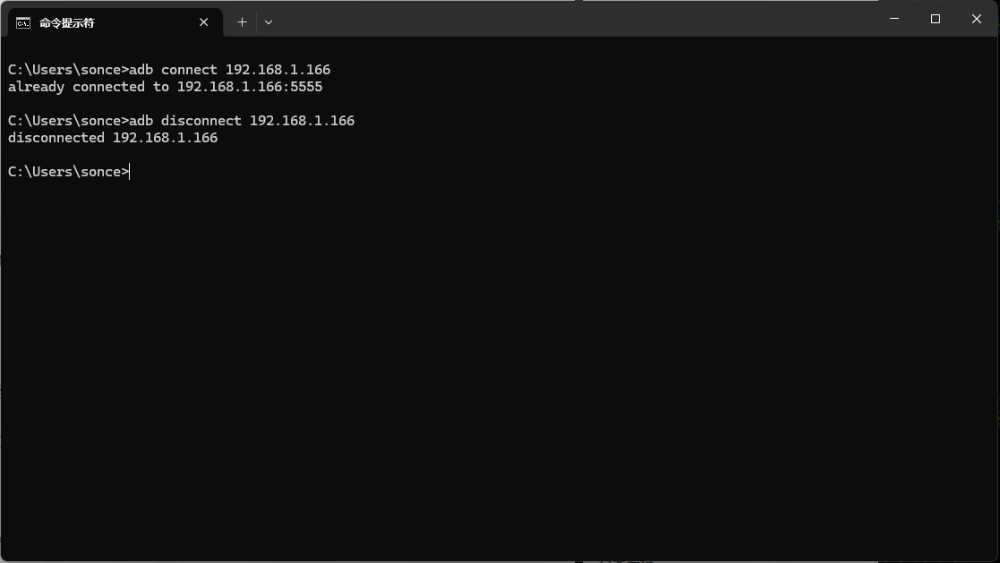

近期弄了个5ber，搞了一些esim卡，但主力机放了一张流量卡，一张电话卡。已经没法在增加5ber卡了。而5ber主要是接码。于是弄了个
### 开发者模式
- 开启开发者模式
  小米MIUI系统在`我的设备`-`全部参数`- 连续点击`MIUI版本`，澎湃系统是`OS版本`。
- 设置调试模式
  开启`开发者模式`后，在`更多设置`-`开发这选项`，启用下面几个选项。
	1. USB调试
	2. （华为设备）“仅充电”模式下允许ADB调试
### 开启调试模式
https://blog.csdn.net/Vermouth_00/article/details/131088485
#### USB调试模式
``` shell
adb usb
```
#### WIFI无线调试模式

``` shell
adb tcpip 5555

#或者
adb devices #查看已连接的设备
adb -s dd1a6268 tcpip 5555 #指定连接到某设备
```
5555 端口是默认端口，也可以用其他端口，-s是adb中操作指定设备的参数，如果只连接了一台设备可省略此参数。



## 自动开启远程调试(root)

https://www.123pan.com/s/dbcVjv-LsW4h.html提取码:kfVI


每次用 USB 连接手机调试始终不方便。设置为开启无线调试后每次重启手机都要再次手动打开。开启的方法都需要ROOT。

https://blog.zgcwkj.cn/archives/215.html
修改`/system/build.prop` 在末尾增加一条 `service.adb.tcp.port=5555`
``` shell
C:\User\用户名>adb shell
su 
mount -o rw,remount /system
cd /system
echo "service.adb.tcp.port=5555">>build.prop
reboot
```

https://www.52pojie.cn/thread-1703812-1-1.html
```
stop adbd  
setprop service.adb.tcp.port 5555  
start adbd
```
magisk目录 /data/adb/post-fs-data.d 下新建的后缀为 sh 的文件，把上面三个命令粘贴进去。重启后就自动执行了

## 连接手机
### [AnLink](https://apps.microsoft.com/detail/9np036014jtg?hl=en-US&gl=US)
### [Scrcpy-gui](https://github.com/Tomotoes/scrcpy-gui)
### ADB连接
``` shell
adb connect ip #连接
adb disconnect ip #断开连接
```


