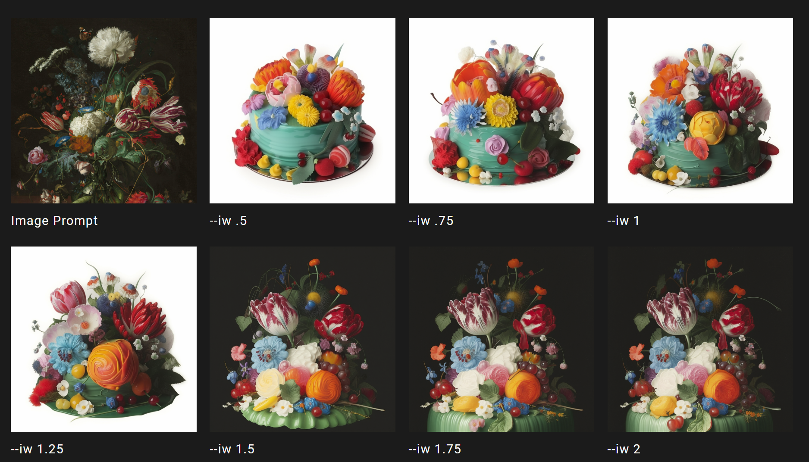
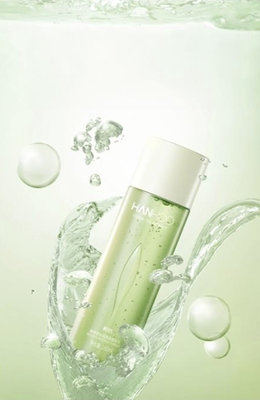
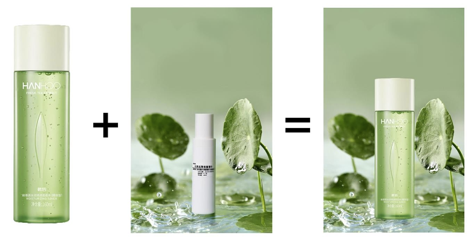

## 关键字提取

使用 Midjourneny 是很方便的。如写关键词，我们可以通过图生文“/describe”功能来智能生成关键词

## **图像权重**

Midjourney 特性的影响（可控性差），我们很难通过关键词直出图来达到符合需求的设计效果，这时需要用别的方式控制一下（垫图），通过垫图控制出图效果，这也是 Midjourney 的优势之一。这时就不得提到「图像权重参数--iw」了。

使用图像权重参数「--iw」来控制垫图与关键词对出图效果的影响。「--iw」的范围是 0-2
「--iw」默认值为 --iw 1（就是你不在后缀输入--iw 参数），「--iw」值越高，垫图影响出图效果越大。一般情况下，我使用最多的还是「--iw 2」这个值。

「图片链接」+ green tea moisturizing essence, in the style of realistic hyper-detailed rendering, sparkling water reflections, matte photo, playful illustrations, yankeecore, high-angle, light white and light green --ar 4:6 --v 5.2 --iw 2
## **控制出图效果**
1. 图片不要带文字
2. 图片不要太乱
3. 图片风格与需求相符

手动拼图，来控制最终的出图效果。产品+场景图=产品图。注意一点的是，垫图的比例最好与最终生成图的比例一致，遇到黑边的情况，就是垫图不规范导致的

