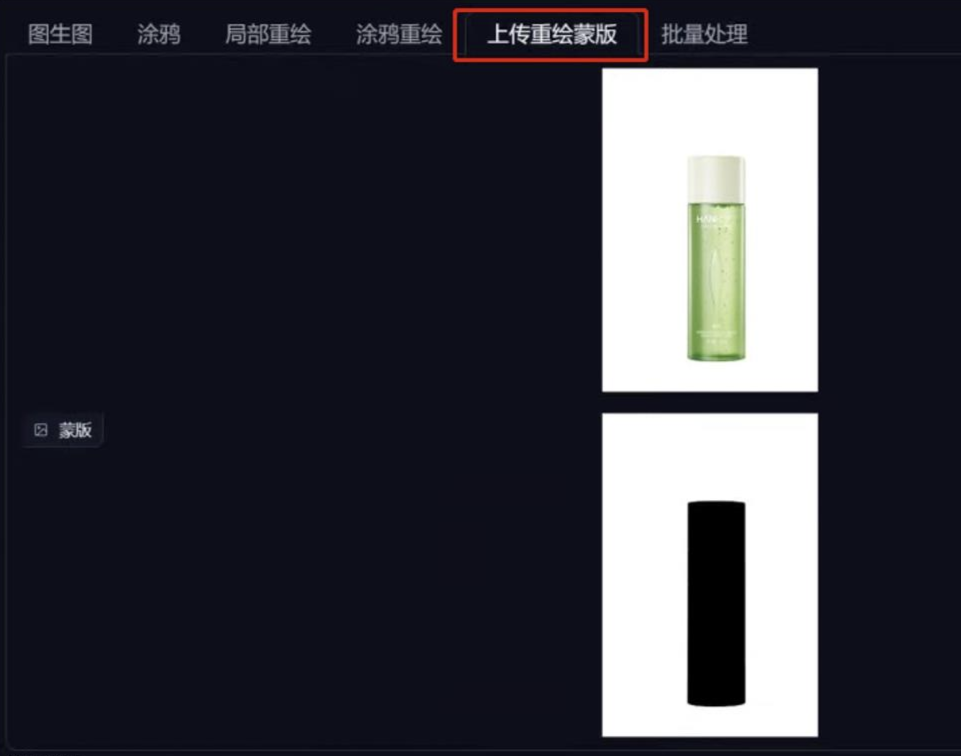
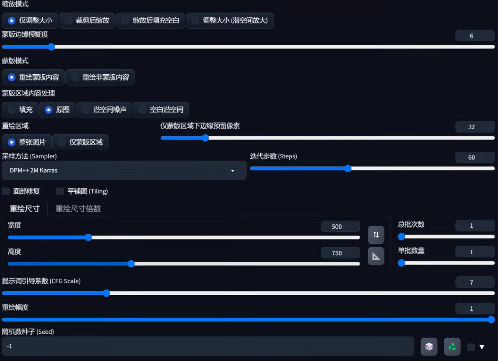
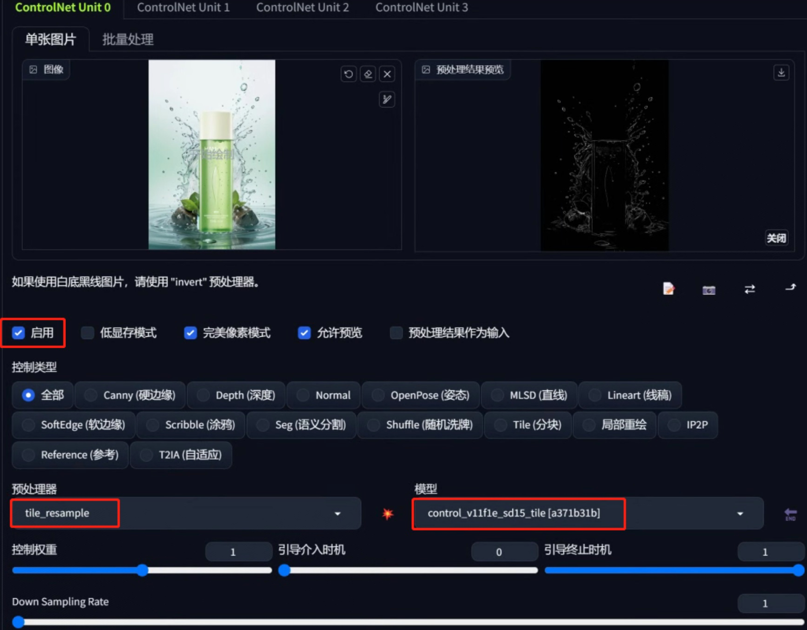

图生图-重绘蒙版”和“controlnet 插件”功能

## 图生图前期准备
使用 PS 软件准备两张图片，一张黑白的蒙版图以及产品白底图。白色为蒙版区域，黑色为非蒙版区域.

## 图生图重绘蒙版
Stable Diffusion 的重绘蒙版功能上传图片，切记上面为产品图，下面为蒙版图。

1. 蒙版模式要选择“重绘蒙版内容”（上面解释了白色为蒙版区域，黑色为非蒙版区域，可反向操作）
2. 重绘尺寸与上传图的比例一致。不然会出现产品拉伸或收缩
3. 重绘幅度拉满是因为我们上传的是白底图，需要 SD 完全给我们重绘白色区域。如果我们上传的是有背景的图，可以降低重绘幅度。
   

## **前期 AI 优化**
产品并没有融合场景中，接下来需要借助 controlnet 功能进一步优化：产品并没有融合场景中，接下来需要借助 controlnet 功能进一步优化
在 controlnet 上传我们上面生成的图，预处理器选择“tile_resample”，模型选择对应的“tile”模型，勾选“启用、完美像素模式”

## **后期 PS 合成优化**
把图生图生成的图片与 controlnet 优化的图片融合一下