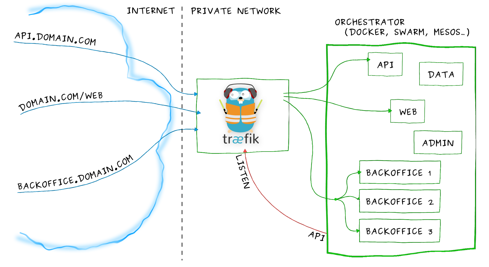

### 简介
Traefik 是一个为了让部署微服务更加便捷而诞生的现代HTTP反向代理、负载均衡工具。它支持多种后台 (Docker, Swarm, Kubernetes, Marathon, Mesos, Consul, Etcd, Zookeeper, BoltDB, Rest API, file…) 来自动化、动态的应用它的配置文件设置。
Traefik 可以监听你的服务发现、管理API，并且每当你的微服务被添加、移除、杀死或更新都会被感知，并且可以自动生成它们的配置文件。此外，Traefik还提供自动发现能力，会实时检测服务，并自动更新路由规则。
总的来说，Traefik的主要作用是作为一个边缘路由器，它会拦截外部的请求并根据逻辑规则选择不同的操作方式，这些规则决定着这些请求到底该如何处理。

假设你已经在你的基础设施上部署了一堆微服务。你可能使用了一个服务发现系统（例如 etcd 或 consul）或者一个资源管理框架（swarm，Mesos/Marathon）来管理所有这些服务。 如果你想让你的用户去从互联网访问你的某些微服务， 你就必需使用虚拟hosts或前缀路径来配置一个反向代理：

域名 `api.domain.com` 将指向你的私有网络中的微服务 `api`  
路径 `domain.com/web` 将指向你的私有网络中的微服务 `web`  
域名 `backoffice.domain.com` 将指向你的私有网络中的微服务 `backoffice` ，在你的多台实例之间负载均衡  
但一个微服务的结构时动态的。。。 服务在会经常被添加、移除、杀死或更新，可能一天之内就会发生许多次。

传统的反向代理原生不支持动态配置。你不可能轻易的通过热更新更改它们的配置。

这时，Træfɪk就诞生了。


### Docker Swarm
```shell
docker network create --driver=overlay --attachable traefik-public
```
traefik.yaml
```yaml
version: '3'

services:
  reverse-proxy:
    image: traefik
    command:
      # 启用dashboard
      - --api.dashboard=true
      - --api.debug=true # enable additional endpoints for debugging and profiling
      - --log.level=DEBUG # debug while we get it working, for more levels/info see https://docs.traefik.io/observability/logs/
      - --providers.docker=true
      - --api.insecure=true # set to 'false' on production
      - --providers.docker.swarmMode=true
      - --providers.docker.exposedbydefault=false
      - --providers.docker.network=traefik-public
      - --entrypoints.web.address=:80
      - --entrypoints.websecure.address=:443
      #- --certificatesresolvers.le.acme.httpchallenge=true
      #- --certificatesresolvers.le.acme.httpchallenge.entrypoint=web
      #- --certificatesresolvers.letsencryptresolver.acme.email=xx@xx.com
      #- --certificatesresolvers.letsencryptresolver.acme.storage=/letsencrypt/acme.json
    ports:
      - 80:80
      - 8080:8080
    volumes:
      #- traefik-certificates:/letsencrypt
      - /var/run/docker.sock:/var/run/docker.sock:ro
    networks:
      - traefik-public
    deploy:
      placement:
        constraints:
          - node.role == manager
      labels:
        - "traefik.enable=true"
        #- "traefik.http.routers.http2https.rule=HostRegexp(`{any:.+}`)"
        #- "traefik.http.routers.http2https.entrypoints=web"
        #- "traefik.http.routers.http2https.middlewares=https-redirect"
        #- "traefik.http.middlewares.https-redirect.redirectscheme.scheme=https"
        #- "traefik.http.middlewares.https-redirect.redirectscheme.permanent=true"
        # dashboard配置
        - "traefik.http.routers.api.rule=Host(`traefik.szjson.cn`)"
        - "traefik.http.routers.api.entrypoints=web" #websecure
        #- "traefik.http.routers.api.tls.certresolver=le"
        # 获取dashboard提供器
        # PS: @后面变量表示routers为api的路径的提供者, 像之前的hello-world实际上省略了@docker
        - "traefik.http.routers.api.service=api@internal"
        # 基本验证中间件
        #- "traefik.http.routers.api.middlewares=api-auth"
        # 配置用户名密码
        # 这里默认是用户名密码都是admin
        # 可以用htpasswd(https://httpd.apache.org/docs/2.4/programs/htpasswd.html)生成用户名密码
        #- "traefik.http.middlewares.api-auth.basicauth.users=admin:$$apr1$$8EVjn/nj$$GiLUZqcbueTFeD23SuB6x0"
        # 最最关键的一步，创建一个dummyService虚服务的loadbalancer，port为api服务监听端口（这里相当于nginx中的upstream）
        # - "traefik.http.services.dummyService.loadbalancer.server.port=9090" #增加了一个负载均衡的端品到taefik的dashboard业务，端口只要是业务没有用的随机的就可以

networks:
  traefik-public:
    external: true
#volumes:
#  traefik-certificates:
```
部署： 
```shell
docker stack deploy --compose-file traefik.yaml traefik
docker service logs -f  traefik
```

### Docker
https://blog.bling.moe/post/14/
https://medium.com/@alexishevia/setting-up-traefik-4026bda980bf