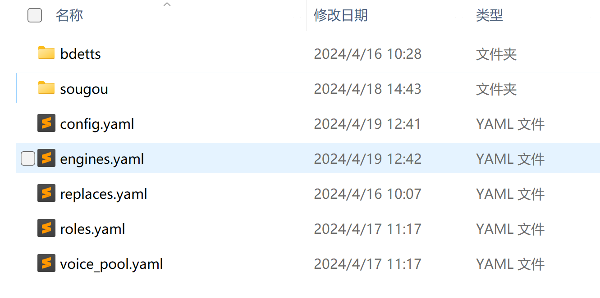
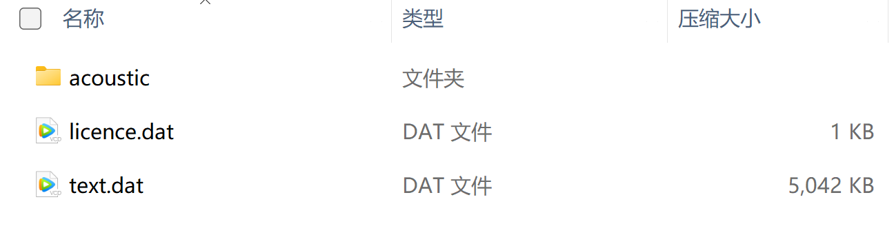

尽管音源角色众多，实际上我们常用的只有那么一小撮。因此，我打算精简数据包，仅保留我钟爱的角色。了解数据包里面的文件作用，以及格式，复制想要角色的相关文件就可以轻松实现。
### 数据包结构
解压数据包，你可以看到有下面的文件。
- bdetts,sougou，存储了对应引擎的头像和语音的文件。
- replaces.yaml，多音字配置文件
- roles.yaml，角色文件，用来配置多角色配音。
- voice_pool.yaml，配置男，女的角色，还有一些没有匹配上的男女角色的语音。


1. engines.yaml
   引擎列表。如：微软翻译，呱呱有声等。内容格式如下：
   ``` yml
!!org.nobody.multitts.tts.engine.EngineConfig
engines:
- code: mstrans
  name: 微软翻译
  note: null
  param: |-
    {
      "audioFormat": "audio-24khz-48kbitrate-mono-mp3"
    }
  type: inner
- code: bdetts
  name: BDeTTS
  note: null
```
`code`是引擎的唯一代码，`name`是引擎名字，`note`是注释。这里定义了两个语音，这事例是：一个是微软翻译，和BDeTTS。
2. config.yaml
   配置引擎里面的语音角色。例如大家熟悉的微软翻译里面的晓晓，就在这个配置文件里面配置。内容如下：
```yml
bdetts:
- !!org.nobody.multitts.tts.speaker.Speaker
  avatar: 'bufeiyan.png'
  code: '4_1692786598235098'
  desc: ''
  extendUI: ''
  gender: 0
  name: 步非烟
  note: ''
  param: 90013,com.baidu.BaiduMap
  sampleRate: 24000
  speed: 1.4
  type: 0
  volume: 1.5
  
mstrans:
- !!org.nobody.multitts.tts.speaker.Speaker
  avatar: null
  code: zh-CN-XiaoxiaoMultilingualNeural
  desc: zh-CN, XiaoxiaoMultilingual
  extendUI: null
  gender: 0
  name: 晓晓 多语言
  note: null
  param: zh-CN-XiaoxiaoMultilingualNeural,Default,Default,1.0
  sampleRate: 24000
  speed: 1.0
  type: 1
  volume: 3.0
```
- bdetts和mstrans是引擎的code，在engines.yaml已经定义好。在该引擎code下面就是该引擎的所有角色定义。
- avatar
  头像，例如bdetts引擎下的步非烟的头像是bufeiyan.png，这个头像文件存储在同一个目录下的`bdetts\avatar\bufeiyan.png`
- code
  角色的代号，如离线bdetts引擎步非烟的code是`4_1692786598235098`，我们可以在`bdetts\90013\acoustic`下找到这个code的对应的文件`4_1692786598235098.voc.dat`
- desc：描述
- gender：性别。0为女性，1为男生。如果没有设置avatar属性，在MultiTTS里面会根据这个属性显示男女头像。
- name：名字
- note：备注
- sampleRate：采样率
- speed：语速
- volume：音量
- type：类型。如：在线，离线
### 数据包制作
数据包使用zip压缩，你可以解压数据包文件，查看里面的配置。
配置文件都是使用yml的格式。配置的内容需要符合yml的文件格式规范。
已经了解了数据包的结构以及相关配置文件的内容。现在可以开始制作属于自己的数据包。
我们以步非烟为例。
1. 引擎
   查看增加的角色引擎是否不存在。如果不存在则增加对应的引擎。步非烟的引擎是：bdetts,如果不存在则在engines.yaml文件里追加下面内容：
```yml
- code: bdetts
  name: BDeTTS
  note: null
```
2. 角色配置
   在config.yaml文件里面先找到bdetts的节点。没有则新增。然后在复制步非烟的配置到该节点下面：
```yml
bdetts:
- !!org.nobody.multitts.tts.speaker.Speaker
  avatar: 'bufeiyan.png'
  code: '4_1692786598235098'
  desc: ''
  extendUI: ''
  gender: 0
  name: 步非烟
  note: ''
  param: 90013,com.baidu.BaiduMap
  sampleRate: 24000
  speed: 1.4
  type: 0
  volume: 1.5
```
3. 头像文件
   在`bdetts\avatar`文件夹下，`bufeiyan.png`复制到自定义数据包的同样目录下。
4. 语音模型
   从`param: 90013,com.baidu.BaiduMap`得知语音模型文件在90013文件夹下。
   
   复制licence.dat，test.data。
   步非烟的code是：4_1692786598235098。在`acoustic`文件夹下找到`4_1692786598235098.voc.dat`复制到数据包的同样目录。
   5. 打包数据包
   建议使用7zip压缩数据包目录为zip。使用系统自带的zip压缩，无法导入到MultiTTS。

### 数据包导入
在手机打开MultiTTS,右上角的三个点-导入数据。选择做好的数据包导入即可。