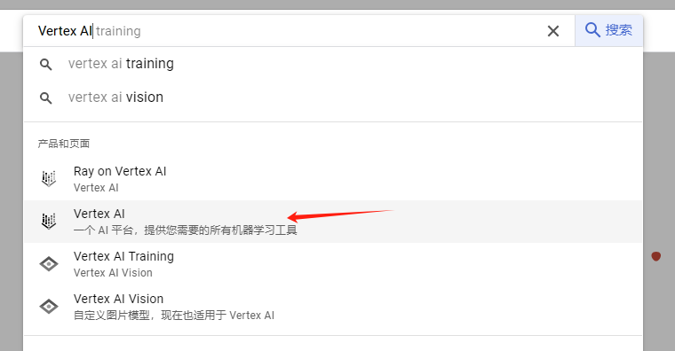
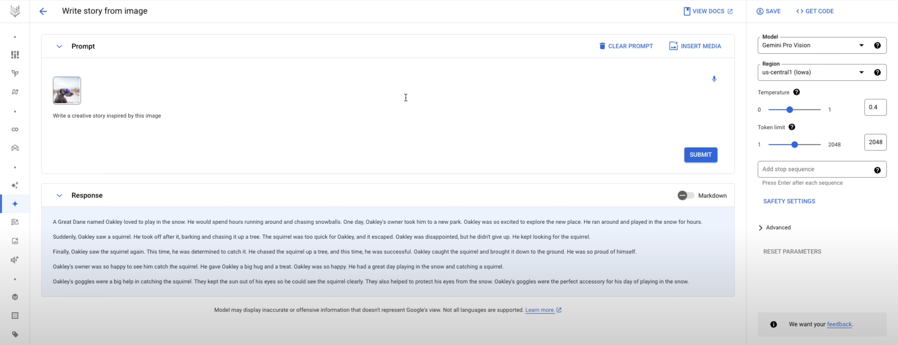
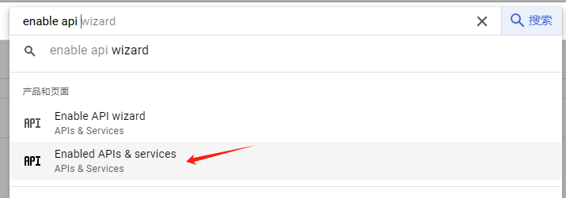
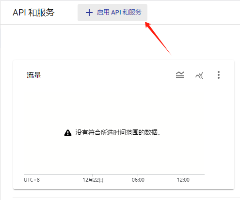
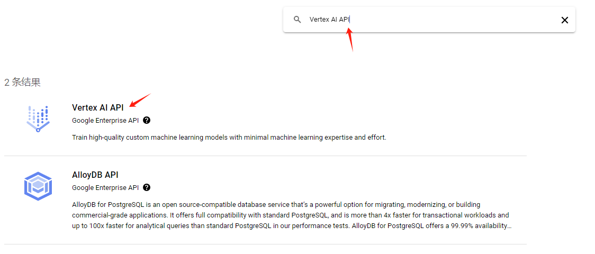
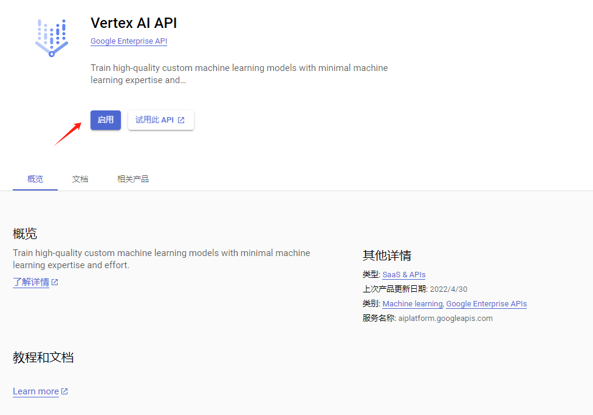
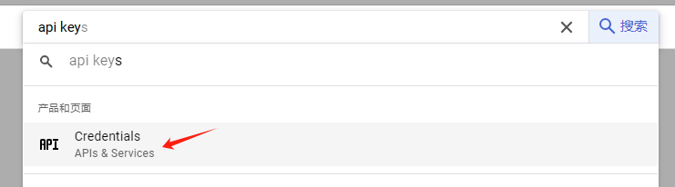
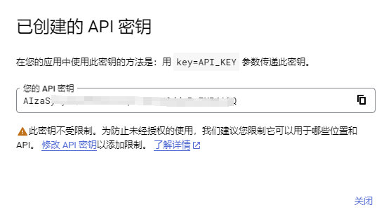

## 背景
Google Gemini 是 Google 开发的一系列多模态生成式 AI 模型。Gemini 模型可以根据你选择的模型变体，接受文本和图像作为提示，并输出文本响应。

Google Gemini有三个版本：
- Gemini Ultra 是最强大的版本，可以处理复杂任务，跨多种媒体进行推理。
- Gemini Pro 是面向开发者的版本，可以在成本和延迟方面进行优化，展示出强大的推理和多模态能力。
- Gemini Nano 是面向 Android 开发者的版本，可以在低内存和高内存设备上本地离线运行。

## 如何使用Gemini
### Google Bard
1. 科学上网。当然有些地区没有开通，具体看[在哪里可以使用 Bard](https://support.google.com/bard/answer/13575153?hl=zh-Hans)。否则会出现
   `你所在的国家/地区目前暂不支持 Bard。敬请期待！`
2. 进入[Bard](https://bard.google.com/chat)官网，目前是免费使用的。
3. 使用Bard的时候，中文也是可以的，但结果并没有英文的结果好。

现在测试下发布会的这个图片。whitch way should the duck go?
   

### GCP
先有一个GCP账号。[GCP](https://console.cloud.google.com/),具体注册请自行搜索。没有Project，先创建

### Google Gemini  Api
在[GCP](https://console.cloud.google.com/)搜索框中输入：`Enable API`,进入Enable APIS & services

进入`启用API和服务`

分别搜索下面三个API，并启用：
1. Generative Language
2. Notebooks API
3. Vertex AI API

回到[GCP](https://console.cloud.google.com/)，在搜索框输入`API KEY`,进入`Credentials`

## Google AI Studio
[Google AI Studio](https://makersuite.google.com/)

