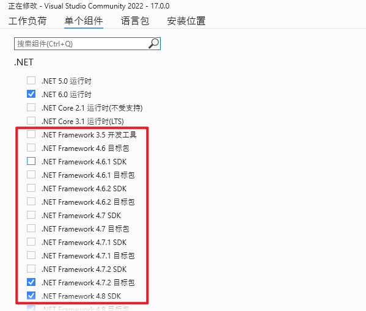
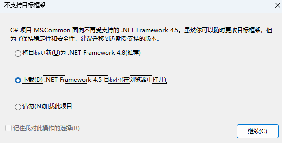
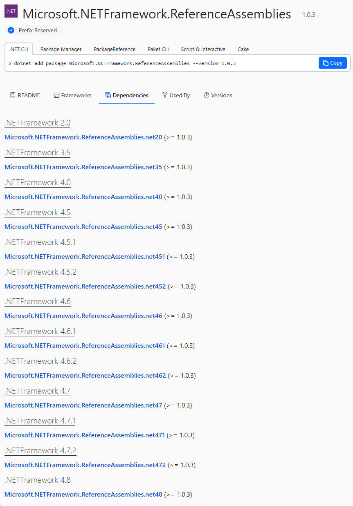
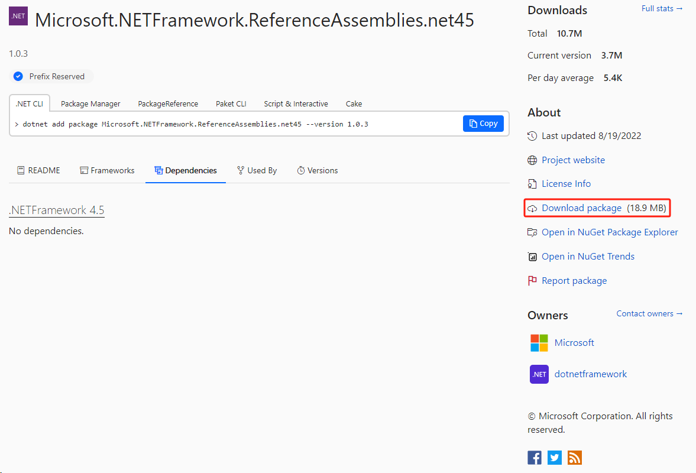

默认Visual Studio 2022 不再支持安装 .NET Framework 4.5 组件

从Nuget下载对应版本的[Microsoft.NETFramework.ReferenceAssemblies](https://www.nuget.org/packages/Microsoft.NETFramework.ReferenceAssemblies#dependencies-body-tab)

选择对应的版本，点击`Download package`

下载后，将nupkg后缀改成zip，并解压
将`build\.NETFramework\`下的`v**`文件夹复制到`C:\Program Files (x86)\Reference Assemblies\Microsoft\Framework\.NETFramework`目录

重启VS